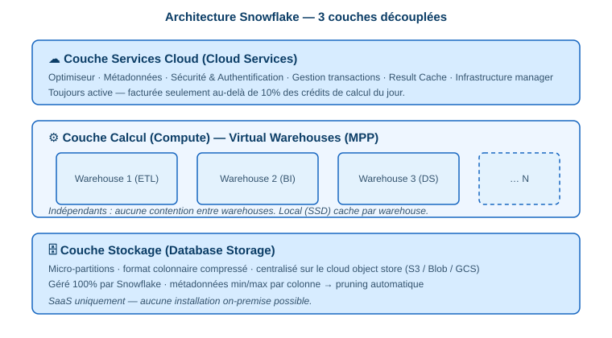

# 1.1 Décrire et utiliser l'architecture Snowflake

> **Domain 1.0 — Snowflake AI Data Cloud Features & Architecture (31%)**

## Architecture hybride

Snowflake combine deux architectures classiques :

| Architecture | Caractéristique |
|---|---|
| **Disque partagé** | Stockage central unique, accessible par tous les nœuds |
| **Sans partage (MPP)** | Chaque nœud calcule indépendamment |

> L'hybridation offre la **simplicité** du disque partagé + les **performances** du MPP.

## Les 3 couches découplées ⭐

| Couche | Rôle |
|---|---|
| **Services Cloud** | Optimiseur, métadonnées, sécurité, authentification, gestion des transactions, **result cache** |
| **Calcul (Compute)** | Entrepôts virtuels (MPP), indépendants entre eux, cache local SSD par warehouse |
| **Stockage (Storage)** | Micro-partitions colonnaires compressées, centralisées sur l'object store du cloud |

!!! warning "Question fréquente"
    Les entrepôts virtuels **ne partagent aucune ressource** de calcul entre eux → **aucune contention** de performance d'un warehouse à l'autre.

### Détail des couches

- **Stockage** : format colonnaire compressé, découpé en micro-partitions (50–500 Mo non compressés), géré 100 % par Snowflake, stocké sur AWS S3 / Azure Blob / GCS.
- **Calcul** : un entrepôt virtuel = un cluster de calcul. Exécute SQL, Snowpark (Python/Java/Scala). `AUTO_SUSPEND` / `AUTO_RESUME` configurables.
- **Services Cloud** : toujours actifs. Facturés seulement **au-delà de 10 %** des crédits de calcul consommés sur la journée.

## Snowflake est un SaaS

!!! danger "Piège exam"
    Snowflake **ne peut pas** s'installer on-premise. Il tourne **uniquement** sur AWS, Azure ou GCP. C'est un SaaS managé de bout en bout.

## Types de cloud computing (rappel)

- **IaaS / PaaS / SaaS** : Snowflake = **SaaS**.
- Avantages cloud : élasticité, paiement à l'usage, séparation stockage/calcul, scalabilité quasi instantanée.

📎 *Réf. officielle : `docs.snowflake.com/en/user-guide/intro-key-concepts`*
