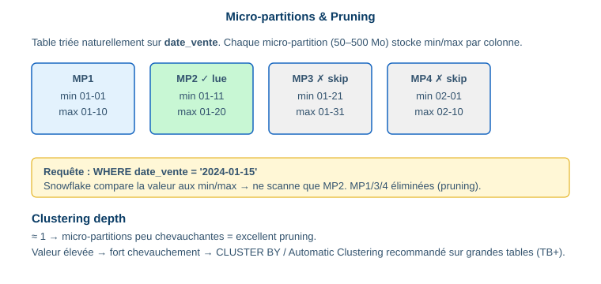

# 1.5 Concepts de stockage

> **Domain 1.0 — Architecture (31%)**

## Micro-partitions ⭐



| Caractéristique | Valeur |
|---|---|
| Taille | 50–500 Mo (non compressé) |
| Format | Colonnaire |
| Gestion | 100 % automatique |
| Métadonnées | min/max par colonne, nb de valeurs distinctes |

Le **pruning** : Snowflake compare le filtre aux min/max stockés et **élimine** les micro-partitions non pertinentes.

```sql
SELECT * FROM ventes WHERE date_vente = '2024-01-15';
-- données triées chronologiquement → pruning très efficace
```

## Clustering & clustering depth ⭐

```sql
-- Clé de clustering sur très grande table (TB+)
ALTER TABLE ventes CLUSTER BY (date_vente, region);

-- État du clustering
SELECT SYSTEM$CLUSTERING_INFORMATION('ventes', '(date_vente, region)');
SELECT SYSTEM$CLUSTERING_DEPTH('ventes');
```

!!! danger "Clustering depth"
    - Proche de **1** → micro-partitions peu chevauchantes → excellent pruning.
    - Valeur **élevée** → fort chevauchement → reclustering bénéfique.

✅ Utiliser un clustering key si : table > plusieurs TB, filtres récurrents sur les mêmes colonnes, insertions désordonnées.
❌ Inutile sur petites/moyennes tables (le clustering automatique suffit).

## Types de tables (rappel) & vues

Voir [1.3](1-3-objets.md). Permanent (Fail-safe), Transient/Temporary (sans Fail-safe), External, **Iceberg**, **Dynamic**. Vues : Standard, **Materialized**, **Secure**.

📎 *Réf. : `docs.snowflake.com/en/user-guide/tables-clustering-micropartitions`*
