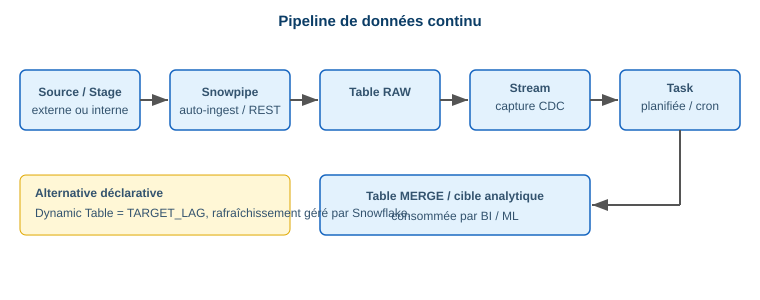

# 3.2 Ingestion automatisée

> **Domain 3.0 — Data Loading, Unloading & Connectivity (18%)**

## Snowpipe ⭐

Chargement **continu / micro-batch** des fichiers dès leur arrivée dans un stage.

```sql
CREATE PIPE mon_pipe AUTO_INGEST = TRUE AS
  COPY INTO ventes FROM @ext_stage FILE_FORMAT = (FORMAT_NAME='ff_csv');
```

- **Auto-ingest** : notifications cloud (S3 SQS, Event Grid, Pub/Sub).
- **REST API** : déclenchement explicite (`insertFiles`).
- **Serverless** : facturé à l'usage (pas de warehouse dédié).

## COPY INTO vs Snowpipe vs Snowpipe Streaming ⭐

| Critère | COPY INTO | Snowpipe | Snowpipe Streaming |
|---|---|---|---|
| Déclenchement | Manuel / Task | Fichier arrivé | API lignes |
| Granularité | Batch | Micro-batch fichiers | **Lignes** (rowset) |
| Latence | Minutes+ | ~secondes-minutes | **Quasi temps réel** |
| Compute | Warehouse | Serverless | Serverless / SDK |

!!! danger "Piège exam"
    **Snowpipe** charge des **fichiers** ; **Snowpipe Streaming** charge des **lignes** sans fichier intermédiaire (latence plus faible, idéal Kafka).

## Streams, Tasks & Dynamic Tables



- **Stream** : capture les changements (CDC) d'une table.
- **Task** : exécute du SQL selon un planning ou une dépendance.
- **Dynamic Table** : table déclarative rafraîchie automatiquement (`TARGET_LAG`).

```sql
CREATE STREAM s_ventes ON TABLE ventes_raw;
CREATE TASK t_merge WAREHOUSE = wh_etl SCHEDULE = '5 MINUTE'
  WHEN SYSTEM$STREAM_HAS_DATA('s_ventes') AS
  MERGE INTO ventes t USING s_ventes s ON t.id = s.id ...;
```

📎 *Réf. : `docs.snowflake.com/en/user-guide/data-load-snowpipe-intro`*
