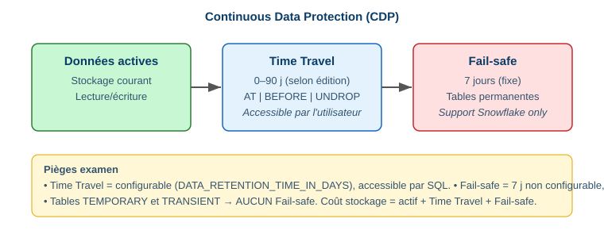

# 5.1 Collaboration & protection des données

> **Domain 5.0 — Data Collaboration (10%)**

## Continuous Data Protection (CDP) ⭐



| Niveau | Durée | Accès |
|---|---|---|
| **Time Travel** | 0–90 j (édition + config) | Utilisateur (SQL) |
| **Fail-safe** | 7 j fixes | Support Snowflake uniquement |

```sql
ALTER TABLE t SET DATA_RETENTION_TIME_IN_DAYS = 30;
SELECT * FROM t AT (TIMESTAMP => '2024-01-15 10:00:00'::TIMESTAMP);
SELECT * FROM t BEFORE (STATEMENT => '8e5d0ca9-...');
SELECT * FROM t AT (OFFSET => -3600);     -- il y a 1 h
UNDROP TABLE t;
```

!!! danger "Pièges"
    - Time Travel = configurable, SQL. Fail-safe = 7 j fixe, support only.
    - Tables **TEMPORARY/TRANSIENT** → **pas de Fail-safe**.
    - Coût stockage = actif + Time Travel + Fail-safe.

## Clonage Zero-Copy ⭐

```sql
CREATE TABLE t_dev CLONE t_prod;
CREATE DATABASE db_dev CLONE db_prod;
CREATE TABLE t_hier CLONE t AT (OFFSET => -86400);   -- clone + Time Travel
```

- Clone **instantané**, 0 octet copié au départ (partage des micro-partitions).
- Coût = uniquement les données **modifiées après** le clone.

!!! warning "Privilèges sur clones"
    Les GRANTs de l'objet **source ne sont pas copiés**. Le owner du clone = le rôle qui a exécuté `CREATE ... CLONE`. Les privilèges sur **sous-objets** d'un schéma cloné sont copiés.

Objets clonables : table, schéma, base, stage interne, file format, séquence. **Non clonables** : stream, pipe, task.

## Réplication & failover

- Réplication de bases/objets entre régions/clouds (Business Continuity).
- `ALTER DATABASE db_replica PRIMARY;` pour basculer.

📎 *Réf. : `docs.snowflake.com/en/user-guide/data-time-travel`*
