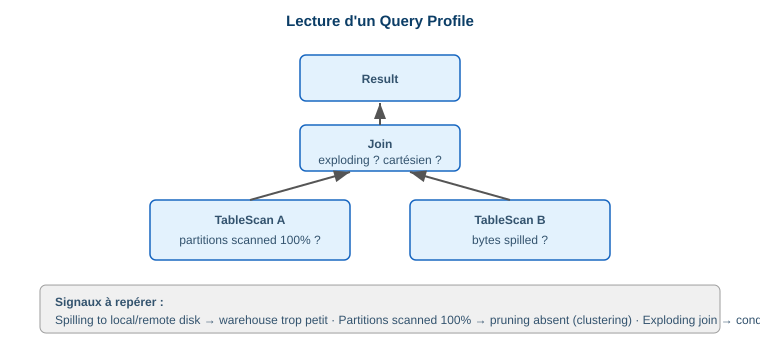

# 2.1 Troubleshoot underperforming queries

> **Domain 2.0 — Performance Optimization (19%)**

## Démarche : lire le Query Profile

Le **Query Profile** (Snowsight → Query History → clic sur une requête) est l'outil n°1 pour diagnostiquer une requête lente.



## Indicateurs clés à repérer ⭐

| Indicateur | Signification | Action |
|---|---|---|
| **Bytes spilled to local storage** | Mémoire du warehouse insuffisante | Agrandir le warehouse |
| **Bytes spilled to remote storage** | Spill massif (très coûteux) | Agrandir warehouse + réduire le volume traité |
| **Partitions scanned ≈ total** | Pas de pruning | Améliorer le clustering / filtres |
| **Cartesian Join / Exploding Join** | Jointure sans clé | Corriger la condition de jointure |
| **% Time = Remote Disk I/O** | Lecture disque dominante | Pruning, cache, clustering |
| **Synchronization** | Skew entre threads | Revoir la distribution |

```sql
-- Statistiques d'exécution détaillées
SELECT * FROM TABLE(GET_QUERY_OPERATOR_STATS('<query_id>'));

-- Requêtes les plus coûteuses sur 7 jours
SELECT query_id, query_text, execution_time, bytes_spilled_to_local_storage
FROM SNOWFLAKE.ACCOUNT_USAGE.QUERY_HISTORY
WHERE start_time > DATEADD('day', -7, CURRENT_TIMESTAMP())
ORDER BY execution_time DESC LIMIT 20;
```

!!! danger "Piège exam"
    Le **spilling vers le stockage remote** est le signal le plus grave : il indique que le warehouse manque cruellement de mémoire. La réponse attendue est **augmenter la taille du warehouse**, pas ajouter des clusters (le multi-cluster gère la *concurrence*, pas la taille d'une requête unique).

## Pruning de partitions

Un mauvais **pruning** (partitions scanned proche du total) est la cause la plus fréquente de lenteur sur grosses tables. Vérifier que les filtres portent sur les colonnes de clustering naturel ou définies.

📎 *Réf. : `docs.snowflake.com/en/user-guide/ui-snowsight-activity`*
