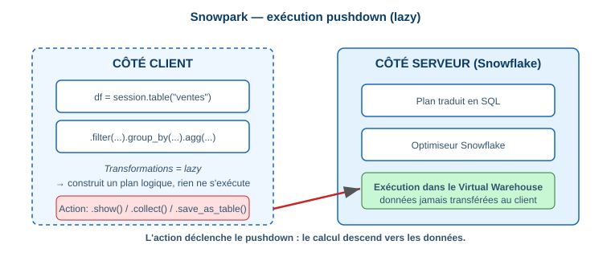

# 5.7 Snowpark pour les transformations

> **Domain 5.0 — Data Transformation (25%)**

## Architecture (pushdown)



Le code Python/Java/Scala est traduit en **plan logique** puis exécuté **dans le warehouse Snowflake** — aucune donnée ne transite côté client (sauf `.show()`/`.collect()`).

## DataFrames Snowpark

```python
from snowflake.snowpark.functions import col, sum as sum_, avg, when, lit

df = session.table("ventes")

df_resume = (df
    .filter(col("region") == "EMEA")
    .group_by("region", "date_vente")
    .agg(sum_("montant").alias("total"), avg("montant").alias("moyenne"))
    .sort(col("date_vente").desc()))

df_resume.write.mode("overwrite").save_as_table("ventes_resume_emea")
```

```python
# Colonnes calculées, CASE WHEN, jointures
df = df.with_column("tva", col("montant") * lit(0.2))
df = df.with_column("categorie",
    when(col("montant") > 1000, lit("Premium"))
    .when(col("montant") > 100, lit("Standard"))
    .otherwise(lit("Petit")))
df_join = df.join(session.table("clients"), df["client_id"] == col("id"), "left")
```

!!! danger "Piège exam"
    Snowpark est **lazy** : les transformations (`filter`, `select`, `join`) ne s'exécutent qu'à une **action** (`show`, `collect`, `count`, `save_as_table`). Tout est *pushed down* en SQL dans Snowflake → pas de transfert de données massif vers le client.

!!! tip
    `df.save_as_table(mode="overwrite"|"append")` matérialise le résultat. `cache_result()` matérialise un DataFrame intermédiaire réutilisé plusieurs fois.

📎 *Réf. : `docs.snowflake.com/en/developer-guide/snowpark/index`*
